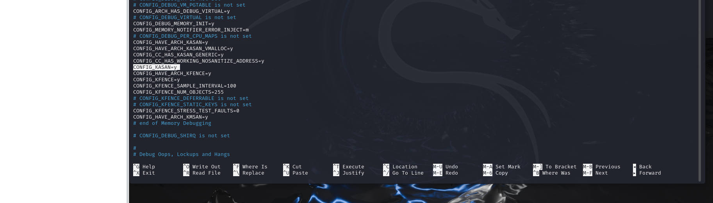

# Журнал Работ

### Техническое задание

1. Написать модуль ядра Linux для хранения секретов. Этот драйвер должен создавать специальный файл в procfs. С помощью этого интерфейса пользователь должен иметь возможность сохранить секрет в ядре (некоторые произвольные данные), прочитать секрет, удалить секрет. Для этого каждой порции секретных данных должен назначаться идентификатор.
2. Добить userspace-программу для тестирования драйвера
3. Собать ядро Linux и свой модуль с поддержкой KASAN, запустить userspace-тест и попробовать обнаружить ошибки доступа к памяти в коде. Если таких нет, то намеренно добавить ошибку доступа к памяти в свой модуль ядра и поймать ее с помощью KASAN.
4. Документация на русском и английском, комментарии к коду на русском и английском, все во благо opensource комьюнити!

### Предисловие

Опыта использования что Си, Что Си подобных языков у меня никогда не было, данный проект модуля ядра будет не просто первым моим модулем ядра, а еще и первым моим проектом на Си. Наверное весьма уникальный случай - начать изучать язык C не с базовых задачек, а сразу с программирования модулей ядра. Так что, возможно на создание кода уйдет немного больше времени, чем нужно, и будет он не самый красивый, но эксперимент получится крайне интересный. Код будет переделываться с ростом моих навыков, которые на таких начальных этапах приобретаются крайне быстро, поскольку изначально я буду делать простенький каркас на основе методических материалов, а по мере понимания языка рефакторить и дополнять его - будет весьма интересна история версий. Данный журнал будет представлять мое погружение в замечательный мир низкоуровневых языков, действия будут выполнятся поэтапно, с базовых механизмов, до рабочего драйвера. Коммиты постарался насытить комментариями для наглядности своих действий. 

Надеюсь, что первые 2 части текста не вызовут у читателя непреодолимое желание закрыть журнал - они представляют собой не столько разработку, сколько мой процесс обучения и исследования работы с драйверами, но не конечный результат.

### Часть 1. Хранилище на одну запись. **Linux_Secret_Keeper-v.0.01**

Поскольку procfs хранит в себе не фактические файлы, в привычном смысле этого понимания, а их эмуляцию, вернее даже сказать абстракцию, созданную для удобства и сохранения нервных клеток потенциальных разработчиков, нам нужно создать драйвер, который будет принимать системные вызовы чтения и записи, и возвращать какой то отклик в пользовательское пространство, это будет наш базовый функционал и наша первоочередная задача - отправить вызов записи и чтение, получить информацию.

Начнем мы с организации необходимых нам файлов с макросами и определениями, указания общепринятой в сообществе GPL лицензии и своего авторства:

```bash
#include <linux/init.h>
#include <linux/module.h>
#include <linux/kernel.h>
#include <linux/proc_fs.h>
#include <linux/uaccess.h>
MODULE_LICENSE("GPL");
MODULE_AUTHOR("Ratochka Vyacheslav");
MODULE_DESCRIPTION("A simple procfs storage module.");
MODULE_VERSION("0.01");
```

Далее - по классике, объявления переменных:

```c
#define SECRET_SIZE 128 //максимальный размер секрета
#define PROCFS_NAME "secret_stash" //будущее название "файла" в procfs

static struct proc_dir_entry *storage_filename; //указатель под наш файл
static char storage[PROCFS_MAX_SIZE]; //непосредственно будущая "база"
static unsigned long storage_size = 0; //размер секрета, пока просто объявлен 0

```

Теперь нам необходима функция для чтения данных, все необходимые параметры ей будет передавать имеющийся практически во всех дистрибутивах системный вызов read:

```c
static ssize_t procfile_read(struct file *filePointer, char __user *buffer, size_t buffer_length, loff_t *offset)
{
    if (*offset >= SECRET_SIZE||copy_to_user(buffer, storage, SECRET_SIZE)) { 
        pr_info("fail!");
        return 0;
    }
    else{
        *offset += SECRET_SIZE;
    }
    return SECRET_SIZE;
}

```

Разберем данную функцию:

```c
if (*offset >= SECRET_SIZE||copy_to_user(buffer, storage, SECRET_SIZE))
```

Фактически это алгоритм для чтения файла, есть проверка для указателя offset, он передается при вызове read и отвечает за текущий считываемый символ, как бы выступая указателем текущей позиции в файле. Когда он дойдет до конца файла - функция прервется, пока этого не произошло - файл считывается. 

Чтение на базовом уровне готово, теперь необходимо записывать данные:

```c
static ssize_t procfile_write(struct file *file, const char __user *buff, size_t size, loff_t *off)
{
    newsecret_size = size;
    if (newsecret_size > SECRET_SIZE){
        newsecret_size = SECRET_SIZE;
    }
    if (copy_from_user(storage, buff, newsecret_size)){
        return -EFAULT; 
    }
    storage[newsecret_size & (SECRET_SIZE - 1)] = '\0';
    pr_info("procfile write %s\n", storage);
    return newsecret_size;
}

```

Данная функция также принимает все необходимые параметры от системных вызовов, передать ей данные можно например следующей командой:

```c
echo "secret" | tee /proc/secret_stash
```

В ней присутствует небольшая проверка на то, что подаваемый секрет не превышает допустимый размер, идет копирование входных данных из userspace в наше хранилище, а также добавление символа конца файла `\0` в конец строки, в последствии логику нужно будет переделать, но как временное решение - вариант неплохой. 

Далее, небольшой технический модуль под прием системных вызовов и направления их в соответствующие функции:

```c
static const struct proc_ops proc_file_fops = {
    .proc_read = procfile_read,
    .proc_write = procfile_write,
};
```

Теперь нам необходим функционал инициализации:

```c
static int __init procfs2_init(void)
{
    storage_filename = proc_create(PROCFS_NAME, 0644, NULL, &proc_file_fops);
    if (NULL == storage_filename) {
    proc_remove(storage_filename);
    pr_alert("Error:Could not initialize /proc/%s\n", PROCFS_NAME);
    return -ENOMEM;
    }
    pr_info("/proc/%s created\n", PROCFS_NAME);
    printk(KERN_INFO "Hello, World!\n");
    return 0;
}
```

Он будет создавать сущность в procfs, удалять ее в случае, если процесс создания завершился ошибкой и возвращать 0 в случае успеха

Также нам необходим завершающий модуль:

```c
static void __exit procfs2_exit(void)
{
    proc_remove(storage_filename);
    pr_info("/proc/%s removed\n", PROCFS_NAME);
    printk(KERN_INFO "Goodbye, World!\n");
}
```

тут все достаточно прост - удаление нашего драйвера и вывод сообщения об этом, в конце кода добавляем следующую конструкцию и наша первая вариация можно сказать готова.

```c
module_init(procfs2_init);
module_exit(procfs2_exit);
```

Работать с текущим кодом можно следующим образом:

```bash
echo "secret" | tee /proc/secret_stash #запись
cat /proc/secret_stash #чтение
```

### Часть 2. Секретный массив. **Linux_Secret_Keeper-v.0.07**

Поскольку сам код растет, я буду приводить далее в основном ключевые изменения, с полными можно ознакомится в истории коммитов. 

Ну что ж, с хранением одной строчки мы разобрались, теперь нам нужно решить задачу хранения нескольких наборов данных, и их идентификации. Наилучшим образом на мой взгляд тут подойдет массив. Но просто класть туда строчки и обращаться через индексы массива во первых не очень удобно, во вторых - такое проблемно модифицировать. Потому было решено создать отдельную простенькую структуру:

```bash
struct secret {
    int id;
    char data[SECRET_SIZE];
};
```

Также переделаем наше хранилище в массив:

```bash
static static storage[PROCFS_MAX_SIZE];
```

И добавим отдельный буфер под текущий секрет:

```bash
static char secret_buf[SECRET_SIZE];
```

Теперь нам необходим еще и парсер:

```bash
sscanf(secret_buffer, "%c %d %s", &command, &id, secret_data
```

Данный парсер послужит основой для построения 3-х базовых режимов модуля - чтение, запись и удаление. Он будет считывать режим и id записи, теперь нам очевидно необходимо создать надстройку - обработчик.

```c
        case 'W':
            if (next_id >= MAX_SECRETS||id > next_id)
                return -ENOMEM;
            storage[next_id].secret_id = next_id;
            strscpy(storage[next_id].secret_data, secret_data, newsecret_size);
            next_id++;
            return newsecret_size;
```

Данный модуль будет копировать пользовательский ввод напрямую в заданный индекс хранилища:

```c
        case 'R':
            if (id > next_id)
                return -ENOMEM;
            read_index = id;
            pr_info("current index %s\n", id);
            return newsecret_size;
```

С модулем чтения все несколько по иному. Поскольку нам драйвер работает с системными вызовами, а системным вызовам неизвестно сколько строчек нужно читать - они будут читать пока драйвер их отдает. Так что, данный модуль отвечает за то, какую строчку будет отдавать наш драйвер. 

```
        case 'D':
            if (id<0||id > next_id)
                return -EINVAL;
            for (int i = id; i < next_id - 1; ++i) {
                storage[i] = storage[i + 1];
            }
            next_id--;
```

Ну и наконец - модуль удаления, который на самом деле сейчас не очень то рабочий и скорее носит характер “костыля”, он не учитывает случай удаления последней записи, так что при необходимости ее удалить - нужно выдумать новый секрет. Я оставил этот модуль как некую затычку, поскольку пока его делал, узнал что в ядре есть целая система макросов под работу со списками, которая показалась мне гораздо удобнее, чем текущий созданный мной код. Само собой, я буду проводить рефакторинг, но пока оставим так для проверки хоть какой то работоспособности. 

Теперь поговорим о нашем новеньком модуле чтения. Он был полностью удален, написан, удален и написан снова, это можно видеть в истории коммитов, но что бы не плодить в журнале все свои ошибки, напишу финальный вариант для текущей версии сборки :

```c
static ssize_t procfile_read(struct file *filePointer, char __user *buffer, size_t buffer_length, loff_t *offset)
{
    int i;
    char output_buffer[MAX_SECRET_SIZE*(next_id+1)];
    char temp_buffer[MAX_SECRET_SIZE];
    if (read_index == -1){
            for (i = 0; i < next_id; i++) {
                sprintf(temp_buffer, "%d. %s\n",storage[i].secret_id,storage[i].secret_data);
                strcat(output_buffer,temp_buffer);
            }
            if (*offset >= MAX_SECRET_SIZE||copy_to_user(buffer, output_buffer, MAX_SECRET_SIZE)) { 
                pr_info("fail!");
                return 0;
            }
            else{
                *offset += MAX_SECRET_SIZE;
            }

        return MAX_SECRET_SIZE;
            }
    else{
        sprintf(temp_buffer, "%d. %s\n",storage[read_index].secret_id,storage[read_index].secret_data);
        if (*offset >= MAX_SECRET_SIZE||copy_to_user(buffer, temp_buffer, MAX_SECRET_SIZE)) { 
            pr_info("fail!");
            return 0;
        }
        else{
            *offset += MAX_SECRET_SIZE;
        }
        return MAX_SECRET_SIZE;
        }
    return MAX_SECRET_SIZE;
}

```

Модуль серьезно так прибавил размера и веса, теперь он мало того, что работает в двух режимах, на вывод всех данных, и вывод какой то конкретной их части, так еще и выводит их идентификатор, что на мой взгляд очень помогает в визуализации рабочего процесса. Возможно позже я скину эту задачу на userspace программу, но пока так гораздо удобнее проводить дебаг кода. 

Все это было протестировано именно на “правильное” использование, которое описано в документации, сейчас у нас имеется весьма костыльное и неказистое решение, но в целом - делающее саму задачу. Драйвер пишет, драйвер читает, драйвер удаляет, драйвер делает это все с применением идентификаторов. 

### Часть 3. Макросы и проверки. **Linux_Secret_Keeper-v.0.08**

Итак, наш код начал обретать кое-какой функционал, а я постепенно начал обретать интуитивное понимание синтаксиса и логики, а с пониманием языка приходит и осознание несовершенства своей программы, наличия множества ошибок, хочется сделать код лучше, надежнее, красивее. Данная часть будет посвящена этому аспекту.

Пожалуй наиболее главный элемент текущего кода - работа со списком данных, ее будем полностью перекладывать на макрос работы со списками из API ядра [https://www.kernel.org/doc/html/v4.14/core-api/kernel-api.html](https://www.kernel.org/doc/html/v4.14/core-api/kernel-api.html), который во первых - удобнее, во вторых - разработан специально под создание модулей ядра. До этого фактически была попытка изобрести велосипед на квадратных колесах, сейчас же будет создаваться устойчивая и скалируемая структура. Начнем с изменения текущей структуры секрета:

```c
typedef struct secret{
    int secret_id;
    char secret_data[MAX_SECRET_SIZE];
    struct list_head list_node; //техническая структура под работу с макросом
} secret_t;

LIST_HEAD(secrets); //инициализация макроса
```

Далее, введем функцию проверки вхождения:

```
static bool secret_finder(int id, struct list_head *secrets) {
    struct list_head *pos;

    list_for_each(pos, secrets) {
        secret_t *p = list_entry(pos, secret_t, list_node);
        if (p->secret_id == id) {
            return true;
        }
    }
    return false;
}

```

Это бинарная функция, которая проверяет имеется ли элемент в нашем списке, или нет, далее будем использовать под переделку операций.

Итак, переделываем все три функции под новый стандарт, запись:

```c
        case 'W':
            if (next_id >= MAX_SECRETS)
                return -ENOMEM;
            if (secret_finder(id, &secrets))
                return -EINVAL;
            secret_t* new_secret = (secret_t*)kmalloc(sizeof(secret_t), GFP_KERNEL);
            new_secret->secret_id = id;
            strscpy(new_secret->secret_data, secret_data, MAX_SECRET_SIZE);        
            list_add_tail(&new_secret->list_node, &secrets);
            next_id++;
            return newsecret_size;
```

Тут практически полностью изменилась вся структура, теперь мы работаем с надстроенным сверху списком и его заголовками, это занимает больше строчек кода, но в перспективе - сэкономит много нервов и сделает код куда проще что в чтении, что в доработке. А самое главное - больше никакой физической привязки id секрета в его позиции в массиве, возможно стоит добавить возможность не указывать id вовсе, но если это и будет сделано, то только после того, как программа обзаведется нормальным тестированием, да и возникает вопрос в необходимости такого функционала.

Чтение:

```c
        case 'R':
            if (id == -1)
            {
                read_index = id;
                return newsecret_size;
            }
            if (secret_finder(id, &secrets)){
                read_index = id;
                return newsecret_size;
            }
            return -EINVAL;
```

Функция чтения была также переработана, она расширилась, в ней появилась проверка на нахождение читаемого элемента в списке.

Удаление:

```c
        case 'D':
            if (next_id<1)
                return -EINVAL;
            list_for_each_safe(pos, tmp, &secrets) {
                secret_t* p = list_entry(pos, secret_t, list_node);
                if (p->secret_id == id) {
                    list_del(pos);
                    kfree(p);
                    deleted=true;
                }
            }
            if (deleted==true){
            next_id--;
            return newsecret_size;
            }
            return -EINVAL;
```

Прощайте костыли с перезаписыванием элементов и здравствуй полноценное удаление, макрос несет все больше пользы, и теперь удаление наконец стало полноценным удалением. Также на основе макроса была переделана функция чтения (не режим, именно функция), но там фактических изменений не так много, просто переделка, они будут в коммитах.

### **Часть 4. Покрытие тестами. Linux_Secret_Keeper-v.0.08**

Итак, наш код растет, усложняется, и каждый раз сидеть и вбивать туда команды, смотреть верно ли все отработало - по большому счету задача мало того что утомительная, так еще и руками весьма сложно все покрыть, по итогу падает наш производительность и теряется контроль ошибок. Что если кто то решит переполнить буфер? А если кому то захочется не указывать id? А может я вновь решу переписать весь код или включить новую функцию? Итак, встречайте - pytest! На мой взгляд, лучшей библиотеки для тестирования просто не найти, тут и параметризация тестов, и крутые декораторы с гибкой конфигурацией, да еще и наглядный вывод. 

Начнем с формирования тестовых наборов и тестовых ситуаций. Формировать сразу будем под параметризированный прогон тестов:

```
@pytest.mark.parametrize("W_input_id, W_input_data, W_input_result", [
    ['1','123abc','W 1 123abc'], #проверка успешного ввода и вывода первой операции
    ['1','123abc','W 1 123abc\ntee: /proc/secret_stash: Invalid argument\n']#режим поломки
])
```

Проверка записи, набор на запись данных, и ожидаемый ответ в виде отсуствия ошибок, мы будем брать логи от операции записи

Далее, уже тестирование совместно работы записи и чтения:

```python
@pytest.mark.parametrize("WR_input_id, WR_input_data, R_input_id, WR_input_result", [
    ['1','123abc','-1','123abc'], # вводим данные, выбираем режим чтения, смотрим итог
    ['2','321cbd','-1','1. 123abc\n2. 321cbd'],
    ['3','testtest','3','3. testtest'],
    ['breakmode','breakmode','234','R 234\ntee: /proc/secret_stash: Invalid argument\n'] # проверка на чтение несуществующего пункта
])
```

Тут мы смотрим, что верно выводится массив из нескольких записей, отдельная запись и выдается ошибка в случае отсутствия записи

Проверка удаления:

```python
@pytest.mark.parametrize("WD_input_id, WD_input_data, D_input_id, WD_input_result", [
    ['1','123abc','preparing','preparing'], # готовим нагрузку
    ['2','321cbd','preparing','preparing'],
    ['3','testtest','2','1. 123abc\n3. testtest'], # удаляем и смотрим, что все затерлось
    ['breakmode','breakmode','3512','D 3512\ntee: /proc/secret_stash: Invalid argument\n'] # режим поломки
])
```

Тут у нас параметры для удаления записей, сперва они создаются, потом удаляется запись и идет проверка ее удаления, также проверяется попытка удаления несуществующей записи

И под конец - тест, который целенаправленно пытается сломать запись всяческими переполнениями и убеждается, что сломать ничего не вышло:

```python
class Test_group_3:
    def test_input_overflow(self):
        assert write(1,'1'*150) == 'W 1 '+'1'*150+'\ntee: /proc/secret_stash: Invalid argument\n' #попытка превысить длинну
        assert write(-1,'1'*5) == 'W -1 '+'1'*5+'\ntee: /proc/secret_stash: Invalid argument\n' #попытка создать запись вне массива
        assert write(35000,'1'*5) == 'W 35000 '+'1'*5+'\ntee: /proc/secret_stash: Invalid argument\n' 
        for i in range(1,15):
             write(i, i)
        assert write("16", '16') == 'W 16 16\ntee: /proc/secret_stash: Invalid argument\n' #попытка записи сверх лимита
        assert '1. 1\n2. 2\n3. 3\n4. 4\n5. 5\n6. 6\n7. 7\n8. 8\n9. 9\n10. 10\n' in read() #проверка что корректные записи сохранены, некорректных нет
```

Остальной код расположен в репозитории, под названием test.py, способ запуска - в документации

### Часть 5. KASAN. **Linux_Secret_Keeper-v.0.08**

Итак, мы все еще не уверены, а так ли надежен наш проект, насколько он устойчив к утечкам памяти и переполнениям буфера? Может быть тесты проходят, а на уровне ядра есть какая то проблема! Итак, соберем ядро с поддержкой KASAN, пускай проверит что там да как на уровне ядра:



Соберем на новом ядре наш код и проверим нашим юзертестом:


Ну что ж, либо мой тест не столь хороший, либо драйвер и впрямь не содержит утечек памяти. Добавим утечку намеренно!

```jsx
122-ю строчку
secret_t* new_secret = (secret_t*)kmalloc(sizeof(secret_t), GFP_KERNEL);
заменяем на
secret_t* new_secret = (secret_t*)kmalloc(5, GFP_KERNEL);
```

На такой прием начинает ругаться функция strscpy, что ж, пора прощаться!

```jsx
мы заменяем 124-ю строку
strscpy(new_secret->secret_data, secret_data, MAX_SECRET_SIZE);  
на
strcat(output_buffer,secret_data);
```

Как говорится, да кому нужны эти буферы и работа с памятью? Наш тест встревает уже на 3-ем наборе данных


KASAN отработал


Вот так выглядит его отработка

```jsx
[  221.590323] ------------[ cut here ]------------
[  221.590325] kernel BUG at lib/string_helpers.c:1048!
[  221.590332] invalid opcode: 0000 [#2] PREEMPT SMP KASAN NOPTI
[  221.590336] CPU: 1 PID: 3141 Comm: tee Tainted: G      D    OE      6.8.11-custom #1 
[  221.590340] Hardware name: VMware, Inc. VMware Virtual Platform/440BX Desktop Reference Platform, BIOS 6.00 11/12/2020
[  221.590343] RIP: 0010:fortify_panic+0x13/0x20
[  221.590350] Code: 83 7c 8f ff eb d7 90 90 90 90 90 90 90 90 90 90 90 90 90 90 90 90 90 f3 0f 1e fa 48 89 fe 48 c7 c7 c0 74 a8 8b e8 9d fb 22 ff <0f> 0b 90 66 2e 0f 1f 84 00 00 00 00 00 90 90 90 90 90 90 90 90 90
[  221.590353] RSP: 0018:ffffc90000c3f840 EFLAGS: 00010246
[  221.590357] RAX: 0000000000000022 RBX: ffff888103fa1a20 RCX: ffffffff8a321f1e
[  221.590359] RDX: 0000000000000000 RSI: 0000000000000008 RDI: ffffc90000c3f618
[  221.590361] RBP: 1ffff92000187f0b R08: 0000000000000001 R09: fffff52000187ec3
[  221.590363] R10: ffffc90000c3f61f R11: 0000000000000001 R12: ffff888103fa1a24
[  221.590365] R13: dffffc0000000000 R14: ffffc90000c3f8a8 R15: ffffffffc196b360
[  221.590367] FS:  00007f75952df740(0000) GS:ffff8881f1480000(0000) knlGS:0000000000000000
[  221.590370] CS:  0010 DS: 0000 ES: 0000 CR0: 0000000080050033
[  221.590372] CR2: 00007ffd7d1a6ff8 CR3: 0000000117408000 CR4: 00000000000406f0
[  221.590375] Call Trace:
[  221.590377]  <TASK>
[  221.590379]  ? die+0x36/0x90
[  221.590384]  ? do_trap+0x199/0x240
[  221.590388]  ? fortify_panic+0x13/0x20
[  221.590392]  ? do_error_trap+0x8a/0xf0
[  221.590395]  ? fortify_panic+0x13/0x20
[  221.590398]  ? handle_invalid_op+0x2c/0x40
[  221.590401]  ? fortify_panic+0x13/0x20
[  221.590404]  ? exc_invalid_op+0x2d/0x40
[  221.590408]  ? asm_exc_invalid_op+0x1a/0x20
[  221.590414]  ? llist_add_batch+0xbe/0x130
[  221.590417]  ? fortify_panic+0x13/0x20
[  221.590421]  procfile_write+0x6df/0x700 [test]
[  221.590426]  ? srso_alias_return_thunk+0x5/0xfbef5
[  221.590430]  ? __pfx_procfile_write+0x10/0x10 [test]
[  221.590433]  ? __pfx_aa_file_perm+0x10/0x10
[  221.590437]  ? __pfx_select_task_rq_fair+0x10/0x10
[  221.590444]  ? srso_alias_return_thunk+0x5/0xfbef5
[  221.590446]  ? apparmor_file_permission+0x16a/0x2d0
[  221.590450]  ? srso_alias_return_thunk+0x5/0xfbef5
[  221.590454]  proc_reg_write+0x1b7/0x280
[  221.590459]  vfs_write+0x21b/0xd50
[  221.590464]  ? srso_alias_return_thunk+0x5/0xfbef5
[  221.590467]  ? inode_update_timestamps+0x15a/0x530
[  221.590471]  ? __pfx_vfs_write+0x10/0x10
[  221.590474]  ? __pfx_inode_update_timestamps+0x10/0x10
[  221.590478]  ? __pfx_inode_needs_update_time+0x10/0x10
[  221.590481]  ? srso_alias_return_thunk+0x5/0xfbef5
[  221.590484]  ? __fget_light+0x58/0x410
[  221.590488]  ksys_write+0xfe/0x1d0
[  221.590491]  ? __pfx_ksys_write+0x10/0x10
[  221.590494]  ? __entry_text_end+0x101e46/0x101e49
[  221.590499]  do_syscall_64+0x83/0x190
[  221.590503]  ? __pfx_pipe_write+0x10/0x10
[  221.590507]  ? srso_alias_return_thunk+0x5/0xfbef5
[  221.590510]  ? apparmor_file_permission+0x16a/0x2d0
[  221.590513]  ? srso_alias_return_thunk+0x5/0xfbef5
[  221.590515]  ? srso_alias_return_thunk+0x5/0xfbef5
[  221.590518]  ? security_file_permission+0x62/0x90
[  221.590522]  ? srso_alias_return_thunk+0x5/0xfbef5
[  221.590525]  ? rw_verify_area+0x70/0x360
[  221.590528]  ? srso_alias_return_thunk+0x5/0xfbef5
[  221.590531]  ? vfs_write+0x6bc/0xd50
[  221.590534]  ? __pfx___x64_sys_openat+0x10/0x10
[  221.590537]  ? kasan_save_free_info+0x3b/0x60
[  221.590541]  ? __pfx_vfs_write+0x10/0x10
[  221.590545]  ? srso_alias_return_thunk+0x5/0xfbef5
[  221.590548]  ? do_syscall_64+0x8f/0x190
[  221.590552]  ? fpregs_assert_state_consistent+0x21/0xa0
[  221.590556]  ? srso_alias_return_thunk+0x5/0xfbef5
[  221.590558]  ? syscall_exit_to_user_mode+0x88/0x220
[  221.590563]  ? srso_alias_return_thunk+0x5/0xfbef5
[  221.590566]  ? ksys_write+0x17c/0x1d0
[  221.590569]  ? __pfx_ksys_write+0x10/0x10
[  221.590571]  ? srso_alias_return_thunk+0x5/0xfbef5
[  221.590574]  ? syscall_exit_to_user_mode+0x88/0x220
[  221.590578]  ? srso_alias_return_thunk+0x5/0xfbef5
[  221.590580]  ? fpregs_assert_state_consistent+0x21/0xa0
[  221.590583]  ? srso_alias_return_thunk+0x5/0xfbef5
[  221.590586]  ? syscall_exit_to_user_mode+0x88/0x220
[  221.590589]  ? srso_alias_return_thunk+0x5/0xfbef5
[  221.590592]  ? do_syscall_64+0x8f/0x190
[  221.590595]  ? fpregs_assert_state_consistent+0x21/0xa0
[  221.590608]  ? srso_alias_return_thunk+0x5/0xfbef5
[  221.590611]  ? syscall_exit_to_user_mode+0x88/0x220
[  221.590614]  ? srso_alias_return_thunk+0x5/0xfbef5
[  221.590617]  ? do_syscall_64+0x8f/0x190
[  221.590620]  ? srso_alias_return_thunk+0x5/0xfbef5
[  221.590623]  ? fpregs_assert_state_consistent+0x21/0xa0
[  221.590626]  ? srso_alias_return_thunk+0x5/0xfbef5
[  221.590629]  entry_SYSCALL_64_after_hwframe+0x78/0x80
[  221.590632] RIP: 0033:0x7f75953e14e0
[  221.590643] Code: 69 0d 00 64 c7 00 16 00 00 00 b8 ff ff ff ff c3 66 2e 0f 1f 84 00 00 00 00 00 80 3d 89 ee 0d 00 00 74 17 b8 01 00 00 00 0f 05 <48> 3d 00 f0 ff ff 77 58 c3 0f 1f 80 00 00 00 00 48 83 ec 28 48 89
[  221.590645] RSP: 002b:00007ffd7d1a7818 EFLAGS: 00000202 ORIG_RAX: 0000000000000001
[  221.590648] RAX: ffffffffffffffda RBX: 000000000000000b RCX: 00007f75953e14e0
[  221.590650] RDX: 000000000000000b RSI: 00007ffd7d1a7960 RDI: 0000000000000003
[  221.590653] RBP: 00007ffd7d1a7960 R08: 00005558a7868470 R09: 0000000000000001
[  221.590655] R10: 00007f75952edc38 R11: 0000000000000202 R12: 000000000000000b
[  221.590656] R13: 00005558a7868470 R14: 00007f75954b6f20 R15: 00005558a7868410
[  221.590661]  </TASK>
[  221.590662] Modules linked in: test(OE) snd_seq_dummy(E) snd_hrtimer(E) snd_seq_midi(E) snd_seq_midi_event(E) snd_seq(E) qrtr(E) rfkill(E) intel_rapl_msr(E) ppdev(E) intel_rapl_common(E) snd_ens1371(E) snd_ac97_codec(E) vmw_balloon(E) ac97_bus(E) gameport(E) snd_rawmidi(E) snd_seq_device(E) snd_pcm(E) pcspkr(E) snd_timer(E) snd(E) soundcore(E) sunrpc(E) binfmt_misc(E) parport_pc(E) parport(E) ac(E) sg(E) joydev(E) evdev(E) serio_raw(E) dm_mod(E) loop(E) efi_pstore(E) configfs(E) nfnetlink(E) vsock_loopback(E) vmw_vsock_virtio_transport_common(E) vmw_vsock_vmci_transport(E) vsock(E) vmw_vmci(E) ip_tables(E) x_tables(E) autofs4(E) ext4(E) crc16(E) mbcache(E) jbd2(E) crc32c_generic(E) sd_mod(E) t10_pi(E) crc64_rocksoft_generic(E) crc64_rocksoft(E) crc_t10dif(E) crct10dif_generic(E) crc64(E) hid_generic(E) usbhid(E) hid(E) crct10dif_pclmul(E) crct10dif_common(E) crc32_pclmul(E) ata_generic(E) crc32c_intel(E) vmwgfx(E) ghash_clmulni_intel(E) drm_ttm_helper(E) ttm(E) sha512_ssse3(E) sha512_generic(E) mptspi(E) ata_piix(E)
[  221.590743]  drm_kms_helper(E) mptscsih(E) sha256_ssse3(E) sha1_ssse3(E) ehci_pci(E) mptbase(E) uhci_hcd(E) libata(E) psmouse(E) scsi_transport_spi(E) ehci_hcd(E) e1000(E) scsi_mod(E) drm(E) usbcore(E) usb_common(E) scsi_common(E) i2c_piix4(E) floppy(E) button(E) aesni_intel(E) crypto_simd(E) cryptd(E) [last unloaded: test(OE)]
[  221.590773] ---[ end trace 0000000000000000 ]---
```

Думаю отправлять в репозиторий сломанную специально для KASAN программу не несет смысла. Оставим это как завершающую часть отчета, свидетельствующую о том, что модуль +- надежен, поскольку для получения ошибки памяти пришлось намеренно править код!